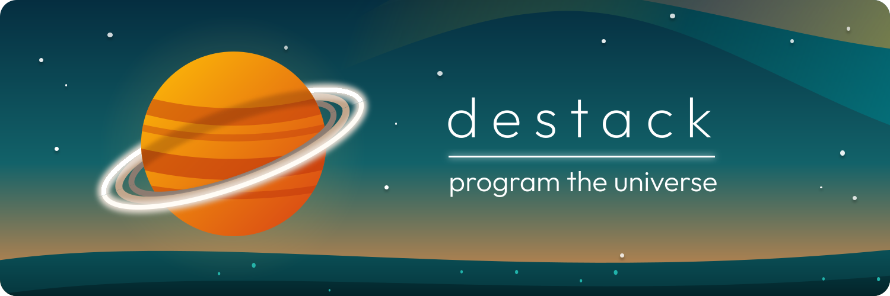

    

# Destack: Universal Software Engine

> [!NOTE]
> **Destack is a universal software engine for building correct, optimal, integrated software systems.**
> 
> Full-stack TypeScript(++) toolchain, VM, AOT compiler, runtime, library, and platform built on open standards.

    
    
    
    

    
    
    
    

**[The Destack](#the-destack) • [Higher-Order Programming](#higher-order-programming) • [Getting Started](#getting-started) • [Targets](#targets) • [Contributing](CONTRIBUTING.md) • [Discord](https://discord.gg/xUFQ45TWYd)**

---

## The Destack

Destack is a universal software engine with a language, runtime, libraries, services, and apps built on top of TypeScript and the open web ecosystem.
Conceptually, Destack is the antithesis to the very idea of a "stack":
instead of wrangling many disparate languages, tools, libraries, approaches, and products, Destack unifies the processes of software development into _one_ computing stack:

- [**Destack Language**](language/README.md): TypeScript(++) toolchain, VM, AOT compiler, runtime.
- [**Destack Library**](library/README.md): Standard library for most things most software needs.
- [**Destack Services**](services/README.md): TODO
- [**Destack Apps**](apps/README.md): TODO
- [**Destack Bridge**](client/README.md): External-facing SDKs (JS/TS, WASM, Rust, Python), IDE integrations, etc.
- [**Destack Templates**](templates/README.md): Ready-to-clone starter kits for common use cases

While Destack is designed from the ground up as an integrated system, you are of course free to pick and choose only the components you like.
It's all open source, open standards, zero lock-in.

---

### Higher-Order Programming

It is over 50 years since the invention of higher order programming with the introduction of the C programming language, yet programming is still astoundingly immature. 
We routinely fail to build trivial software correctly, and even when it works, it is incredibly inefficient, and even when it is, it's not well integrated with other software.

Software is very useful, we have a lot of it, and there is about to be much, much more, with many more exciting possibilities to marry symbolic and probabilistic computation.
We believe the opaqueness, inefficiency, and fragmentation of software as a whole can only be solved by reimagining all software processes; in the limit, this means unifying the disparate parts that have remained separate purely for historical reasons.

The more we can express in software, the higher order the abstractions we can program.
At the start, software was the digital shadow of "real" systems, but at its best, software becomes an enabling technology for new systems that weren't possible before.
There is significant promise in turning more things _into_ correct, optimal, integrated software systems, and we believe a universal software engine is the best way to enable them.

---

## Getting Started

> [!WARNING]
> **Destack is alpha-stage software.**
> Use at your own risk. Things may change or break without notice.

<!--TODO #Incomplete: getting started (`bun i -g @destack/cli`, `curl destack.sh/install`, and local development setup)-->

Install via `curl -fsSL https://destack.sh/install | sh` or `npm i -g @destack/cli`.
Create a new app with `npm create destack@latest my-app` or `bun create destack my-app`.

---

## Targets

Destack supports Linux, MacOS and Windows as TIer 1 targets, with mobile (iOS, Android) still coming online. 
See [TARGETS.md](TARGETS.md).

| Tier | Target triples | Notes | 
|-----------|--------|-----|
| Tier 1 | `aarch64-apple-darwin`, `x86_64-pc-windows-msvc`, `x86_64-pc-windows-gnu`, `x86_64-unknown-linux-gnu`, `aarch64-unknown-linux-gnu` | Full support |
| Tier 2 | `aarch64-apple-ios`, `aarch64-linux-android` | Pending support |
| Tier 3 | `wasm32-wasip1` | Eventual support |

## Contributing

Destack is in [very active development](CONTRIBUTING.md) with a singular focus: a fully integrated software stack for optimal, correct, integrated software systems.
We welcome feedback, issues, ideas, and small fixes, but please reach out first for non-trivial contributions.
See [TESTING.md](TESTING.md) and [CONTRIBUTING.md](CONTRIBUTING.md) for more.

## License

The Destack language, toolchain, library, and platform are fully open source under the MIT license.
See [LICENSE.txt](LICENSE.txt).

Destack includes components licensed, vendored and integrated from third parties, which come with their own licenses including the Apache-2.0 (WITH LLVM-exception) license.
See [THIRD_PARTY_LICENSES.md](THIRD_PARTY_LICENSES.md).
