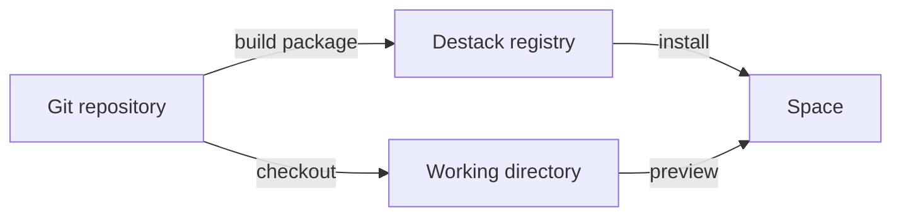

# Packages

- Destack is built around repositories and packages, for everything
- all libraries, services, applications, .. whatever live in packages, and packages live in repositories.
- everything is an app -> everything is a package
<!--- packages can be TS* or TS++-->

- think one or more npm-like package per .git monorepo
- everything is calver and uses a unified tagging / versioning scheme

- packages have `destack.json` similar to / next to `package.json`
- each package has a `destack.json` describing its exports, dependencies, and requirements.
- packages contain applications, services, libraries, models, skills, templates, and assets.

## Registry

- Destack registry is like a personal + central NPM registry (service/registry)
- published packages include source and build artifacts, identified by immutable digests.
- releases use calendar versions and record their source commit and package directory.
- whitelisted npm dependencies use existing package managers / versions + lockfiles

<!--- `service/registry` provides the server and typed client in one package.-->
<!--- `@destack/registry/client` calls the registry; `@destack/registry/server` runs it-->
- NPM-like registry owns and servces packages, can be local or remote
- The registry database stores package ownership, visibility, releases, and artifact references.
<!--- R2 stores package artifacts; Git hosts store repositories.-->

- publication verifies uploaded artifacts before making a release available.
- published releases are immutable.

- package installation resolves dependencies, verifies artifacts, and writes local files
- `platform/` deploys and operates the hosted registry; self-hosted instances use the same service

