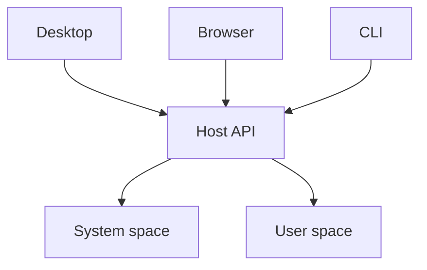

# Hosts

- "hosts" provide the actual runtimes that run spaces
- can be local or can be destack platform hosted
- A space has one authoritative database; workers and processes can use it concurrently.
- Entrypoints declare requirements in destack.json; builds check their dependencies against each target.
- Local hosts use Deno. Hosted request handlers use Workers; persistent processes use containers.

- host provides database, file, secret, scheduling, and notification access
- host recovery remains available when application or system-space code fails

