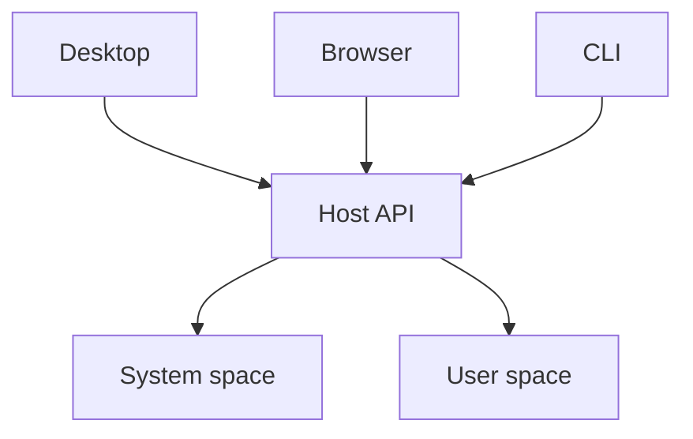

# Hosts

- "hosts" provide the actual runtimes that run spaces
- can be local or can be destack platform hosted
- A space has one authoritative database; workers and processes can use it concurrently.
- Entrypoints declare requirements in destack.json; builds check their dependencies against each target.
- Local hosts use Bun. Hosted request handlers use Workers; persistent processes use containers.

- host provides database, file, secret, scheduling, and notification access
- installed local workloads receive explicit filesystem, network and service permissions
- subprocesses inherit OS restrictions; shutdown terminates the workload process group
- detached subprocesses can survive shutdown on macOS; local sandboxing does not promise hostile process containment
- local checkout builds execute trusted code; hosted untrusted builds require infrastructure isolation
- operations that need additional host access require separate authorization
- @destack/sandbox is a package and private launcher, not a publicly hosted service
- each local sandbox uses one Bun manager process and one workload process; upstream manager policies are process global
- sandbox startup confirms command creation; application readiness uses the service health protocol
- host recovery remains available when application or system-space code fails

