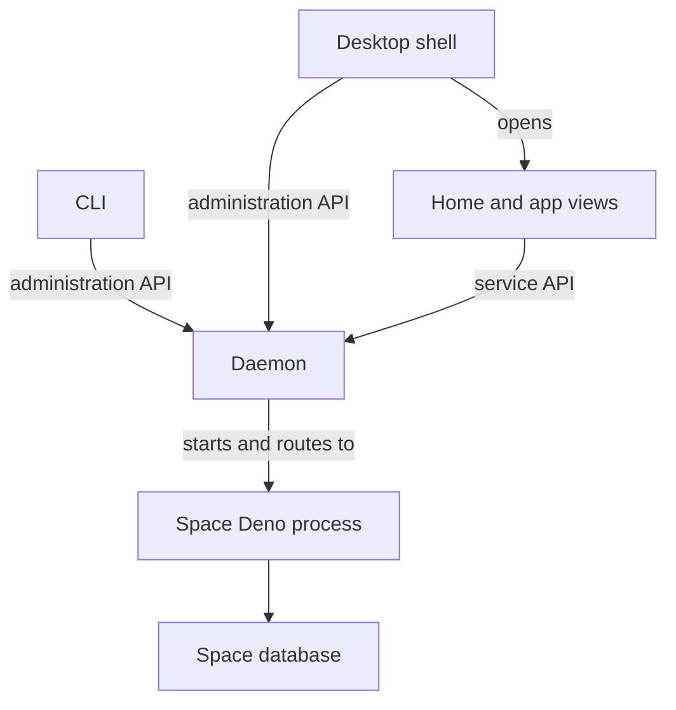

# Development

- everything must be as regular as possible (even once we get to TS++, but especially in TS*)
- edit repositories with ordinary editors, agents, Git tools, ..

- changes should jsut work even when triggered "directly"
- file changes update local previews
- git pushes update tracked branches through webhooks and reconciliation.

- published releases record exact source commits and dependency versions
- installed packages select a release or explicitly follow a branch 
- preview schema changes in a separate space before applying migrations

- shared package definitions and formats describe TS* and TS++ requirements
- the language toolchain retains its compiler, workspace, daemon, and RPC implementations

## Stack

- most boring possible personal stack:
- Deno runs local services; Deno Desktop provides native windows and OS integration.
- Solid 2 renders app views; StyleX defines shared styles and theme tokens.
- oRPC and Zod define HTTP services, clients, and validation.
- Turso provides SQL databases; Drizzle defines schemas and migrations.
- OpenTelemetry records traces, metrics, and logs.
- Libraries can be used by applications, services, and host executables.

## Processes

the daemon and desktop shell have separate lifetimes

- OS service manager starts and restarts the daemon.
- daemon starts space processes with explicit permissions and records their status.
- desktop shell starts and closes windows independently of space processes.

- the CLI and desktop shell use the same device session.
- sign-in through either client updates the same local session under `~/.destack`.

- hosted workers use the same service definitions without running the local daemon (duh)
